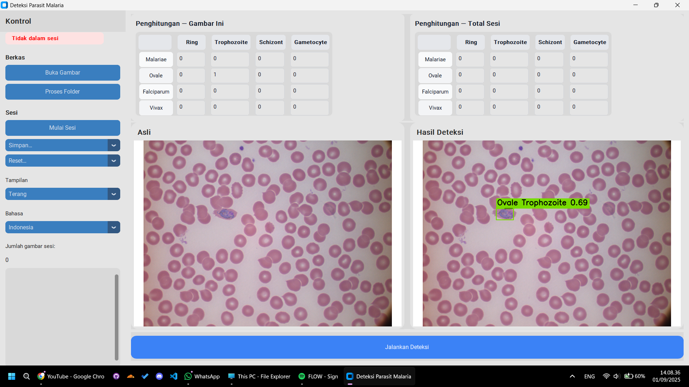

# Malaria Parasite Detection

Malaria Parasite Detection is a deep learning–based software developed to assist in the automatic diagnosis of malaria. The disease is caused by mosquito bites carrying the Plasmodium parasite and remains a serious threat because its symptoms often resemble other illnesses, making it prone to misdiagnosis. Microscopic examination is indeed the gold standard for confirming the presence of parasites, identifying species, stages, and parasite density. However, the accuracy of this examination heavily depends on the microscopist’s experience and the quality of the laboratory facilities.

The Malaria Parasite Detection application is designed using the YOLOv8 algorithm, modified with LAB color space transformation, based on research results that show improved classification accuracy. The system is capable of recognizing all major Plasmodium species that cause malaria (falciparum, vivax, malariae, and ovale), while also identifying parasite developmental stages such as ring, trophozoite, schizont, and gametocyte in blood cell images. LAB increased the mAP50 score to 0.687 compared to RGB 0.612. It's an increase of 12.3%.

With this capability, the software is expected to serve as a reliable diagnostic aid, supporting medical personnel in accelerating and improving the accuracy of malaria case identification.

## Features



- Single Image Detection
- Multiple Image Sessions
- Batch Detection
- Can Detect 4 Species of Malaria and it's 4 Life Stages
- Light/dark mode toggle

## Documentation (Code Explanation)

This section will only explain the codes related to the final product (EXE File) and only explain the final best model that is used. View the paper for a broader understandings: https://ieeexplore.ieee.org/abstract/document/11159455

### Dataset used

This is the dataset that is used for this project, it is chosen because it have all the 4 Common species of Malaria and also annotate it by its 4 Life Stages:
https://github.com/andrealoddo/MP-IDB-The-Malaria-Parasite-Image-Database-for-Image-Processing-and-Analysis

### Converting the Images from RGB to LAB Color Space

```python
import cv2

def convert_rgb_to_lab(image_path):
    img_bgr = cv2.imread(image_path, cv2.IMREAD_COLOR)
    if img_bgr is None:
        return None
    img_lab = cv2.cvtColor(img_bgr, cv2.COLOR_BGR2Lab)
```

We used the provided function in Open CV Library to convert the image from RGB to LAB.

### Training

```python
from ultralytics import YOLO

def main():
    model = YOLO('yolov8n.pt')
    train_results = model.train(
        data='Config.yaml',
        epochs=100,
        imgsz=640,
        batch=16,
        name='malaria',
        verbose=True,
        plots=True,
        pretrained=True,
        seed=0,
    )

    val_results = model.val()
    print("=== Validation Metrics ===")
    print(val_results)

if __name__ == "__main__":
    main()
```

We then trained Ultralytics with the LAB version of the image, and it have the best performance out of all the scenarios mentioned in the paper.

### Converting the .pt Model to .onnx

```python
from ultralytics import YOLO
YOLO("best.pt").export(format="onnx", opset=12, dynamic=True, simplify=True)
```

We then convert the model to .onnx, so it can be compiled into a .exe without the need of dependencies.

### Predictor

```python
class OnnxYoloV8:
    def __init__(self, onnx_path: str, num_classes: int):
        sess_opts = ort.SessionOptions()
        providers = ["CPUExecutionProvider"]
        self.session = ort.InferenceSession(onnx_path, sess_options=sess_opts, providers=providers)
        self.input_name = self.session.get_inputs()[0].name
        self.nc = num_classes
    def _preprocess(self, img_bgr):
        lab = bgr_to_lab(img_bgr)
        lb, ratio, (padw, padh) = letterbox(lab, new_shape=IMGSZ, color=(114,114,114))
        lb = lb[:,:,::-1].copy()
        inp = (lb.astype(np.float32)/255.0).transpose(2,0,1)[None,...]
        return inp, ratio, padw, padh
    def _postprocess(self, pred, ratio, padw, padh, orig_shape, conf_thres=0.25, iou_thres=0.45):
        if pred.ndim == 3: pred = np.squeeze(pred, 0)
        if pred.shape[0] == (4 + self.nc) and pred.shape[1] != (4 + self.nc): pred = pred.T
        boxes_xywh = pred[:, :4]; scores_all = pred[:, 4:]
        if scores_all.max() > 1.0 or scores_all.min() < 0.0:
            scores_all = 1.0 / (1.0 + np.exp(-scores_all))
        cls_idx = np.argmax(scores_all, axis=1)
        cls_scores = scores_all[np.arange(scores_all.shape[0]), cls_idx]
        keep = cls_scores >= conf_thres
        if not np.any(keep): return []
        boxes_xywh = boxes_xywh[keep]; cls_idx = cls_idx[keep]; cls_scores = cls_scores[keep]
        x,y,w,h = boxes_xywh[:,0], boxes_xywh[:,1], boxes_xywh[:,2], boxes_xywh[:,3]
        x = (x - padw)/ratio; y = (y - padh)/ratio; w = w/ratio; h = h/ratio
        x1 = np.clip(x - w/2, 0, orig_shape[1]-1)
        y1 = np.clip(y - h/2, 0, orig_shape[0]-1)
        x2 = np.clip(x + w/2, 0, orig_shape[1]-1)
        y2 = np.clip(y + h/2, 0, orig_shape[0]-1)
        boxes_xyxy = np.stack([x1,y1,x2,y2], axis=1)
        keep_idx = nms_np(boxes_xyxy, cls_scores, iou_thres=iou_thres)
        out = []
        for b, sc, c in zip(boxes_xyxy[keep_idx], cls_scores[keep_idx], cls_idx[keep_idx]):
            out.append([int(b[0]), int(b[1]), int(b[2]), int(b[3]), float(sc), int(c)])
        return out
    def predict(self, img_bgr, conf_thres=0.25, iou_thres=0.45):
        inp, ratio, padw, padh = self._preprocess(img_bgr)
        pred = self.session.run(None, {self.input_name: inp})[0]
        return self._postprocess(pred, ratio, padw, padh, img_bgr.shape, conf_thres, iou_thres)
```

This is a simple wrapper for running YOLOv8 models in ONNX Runtime, making it portable and easy to bundle into .exe applications without large dependencies like PyTorch. Images are first preprocessed by converting to LAB color space, letterboxing to the target size, and normalizing the pixel values. The ONNX model then runs inference, and the predictions are postprocessed by converting box coordinates back to the original image scale, applying confidence and IoU thresholds, and using Non-Maximum Suppression (NMS) to remove duplicates. The output is a clean list of bounding boxes with class IDs and confidence scores, ready for use in detection tasks.

## Installation

Download the app.exe file directly from the repository

## Acknowledgements

### Dataset

Andrea Loddo, Cecilia Di Ruberto, Michel Kocher, Guy Prod'Hom.
MP-IDB: The Malaria Parasite Image Database for Image Processing and Analysis.
In Processing and Analysis of Biomedical Information, pp. 57–65. Springer, Cham, 2019.
https://doi.org/10.1007/978-3-030-13835-6_7

### Model

Glenn Jocher, Ayush Chaurasia, Jing Qiu.
Ultralytics YOLOv8 (Version 8.0.0). 2023.
Available at: https://github.com/ultralytics/ultralytics
.
License: AGPL-3.0.
